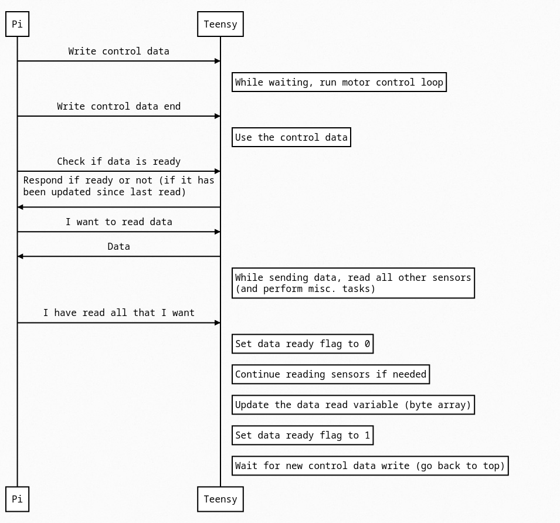

# Communication standards for EDR RCJ2024
## Teensy to Pi
Communication method: I2C

Information from teensy to Pi:
- Motor data
  - Speed
  - Position - Position since last call to startDistanceMeasure
- ToF data
- IMU Data
- Colour sensor data
- Battery voltage

Information from Pi to teensy:
- Motor control values
  - Wanted speed
  - Acceleration limits?

### Concrete implementation
The two computers are synchronized. Communication (and some more things) happen like this:

<!-- Websequencediagrams code for the following image (could also use js-sequence-diagrams)
title Communication: Teensy-Pi
Pi->Teensy: Write control data
note right of Teensy: While waiting, run motor control loop
Pi->Teensy: Write control data end
note right of Teensy: Use the control data
Pi->Teensy: Check if data is ready
Teensy->Pi: Respond if ready or not (if it has\nbeen updated since last read)
Pi->Teensy: I want to read data
Teensy->Pi: Data
note right of Teensy: While sending data, read all other sensors\n(and perform misc. tasks)
Pi->Teensy: I have read all that I want
note right of Teensy: Set data ready flag to 0
note right of Teensy: Continue reading sensors if needed
note right of Teensy: Update the data read variable (byte array)
note right of Teensy: Set data ready flag to 1
note right of Teensy: Wait for new control data write (go back to top) -->

## Vision to Navigation
Communication method: Socket communication

Port: 4242  
Bidirectional: Yes (?)

Information that the protocol should be able to transmit:

- Victim type (including none)
    - Also includes potential victims
- Victim position
- Timestamp for captured image frame

If victim is direclty right/left, first send potential victim, with position and timestamp. Then navigation slows down or stops and updates the slowing/stopping status to the vision program. Then a normal victim type may be sent, the side, position and timestamp.

If victim is in front or out to the sides (for example in adjacent tile), send an unconfirmed victim type, side, position(?) (different from potition above) and timestamp. Then it is up to global navigation to decide wether to investigate or not. Then normal victim handling takes over. No confirmations are sent.

### Concrete implementation
Start char: '!'  
Delimiter: ','

Message types:
- Victim detection: 'v'
- Confirmation: 'c'

Victim detection message structure: !v,\<detection type>,\<victim type>,\<camera>,\<position>,\<timestamp>

- Detection type: 'p'/'c'
- Victim type: 'g'/'y'/'r'/'u'/'s'/'h'
- Camera: Integer staring from 0, incrementing by 1. Fusion program determines left/right
- Position:
    - \<x-coord>,\<y-coord>
    - Integer in mm from the camera center of FOV. Positive direction is normal math coordinate system (positive right-up)
- Timestamp: Unix millisecond timestamp

Confirmation message structure: !c

## Navigation threads
Communication method: Shared variables

Data that should be shared:
- Local robot pose
- Global robot pose
- Array/vector/queue of commands for local to execute
- Fusion -> (global) -> local: detection slowdown
- Fusion -> global -> local: kit drop interrupt
    - Read what to drop and where from other variable
- speed setting (slow, normal, turbo)
- Ground colour data from fusion
- Ramp data: direction, x-length, y-length, (length)
- Väggar
- Obstacles?
- Bump sensor